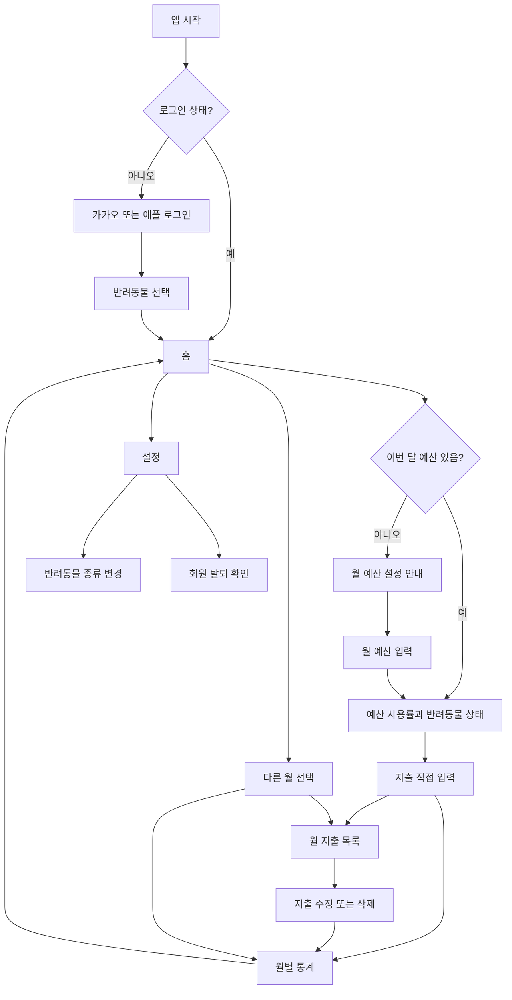

# 유저플로우: Petgyebu MVP

- 기준일: 2026-09-25
- 대상: React Native 모바일 앱(iOS·Android). 서버 계약은 `08-feature-implementation-map.md` 참고.

## 주요 흐름

## 화면별 동작

| 화면 | 입력 또는 표시 | 예외·빈 상태 |
|---|---|---|
| 로그인 | 카카오·애플 중 선택 | 인증 실패 시 재시도 안내 |
| 최초 설정 | CAT 또는 DOG 선택 | 선택을 미뤄도 홈에서 다시 안내 |
| 홈 | 월 총지출, 예산, 남은/초과 금액, 상태, 성장 | 예산 없으면 사용률 대신 설정 버튼. 반려동물 없으면 선택 버튼 |
| 지출 입력 | 금액, 날짜, 카테고리, 선택 메모 | 금액 0 이하·잘못된 날짜·카테고리 거부 |
| 월 목록 | 해당 월의 직접 기록한 지출, 수정·삭제 | 목록이 비면 첫 입력 안내 |
| 월별 통계 | 총액, 건수, 카테고리 합계·비중 | 지출이 없으면 0과 빈 목록 |
| 월 예산 | 선택 월의 목표 금액 생성·변경 | 예산 없으면 미설정으로 표시 |
| 설정 | 반려동물 종류 변경, 탈퇴 | 탈퇴 전 복구 불가 확인 |

## 값의 갱신

지출 생성·수정·삭제와 예산 변경 뒤에는 월 목록, 통계, 홈을 다시 조회한다. 다른 월로 지출 날짜를 옮겼다면 이전 월과 새 월을 다시 조회한다. 월이 바뀔 때 자동 생성 작업은 없으며 새 월 예산은 사용자가 직접 설정한다.
